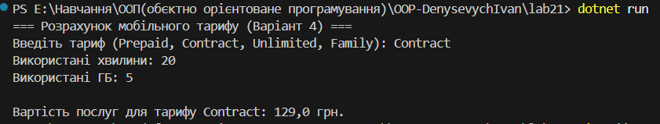

# Лабораторна робота №21: Принцип OCP (Strategy & Factory)

## Варіант 4: Розрахунок вартості мобільного тарифу

### Опис
Проєкт демонструє застосування принципу відкритості/закритості (OCP). Система розрахунку тарифів реалізована за допомогою патерна **Strategy**, а створення об'єктів  через **Factory Method**.

### Реалізовані тарифи:
* **Prepaid**  оплата за кожну одиницю послуг.
* **Contract**  абонплата + знижена вартість.
* **Unlimited**  фіксована ціна.
* **Family (OCP Demo)**  груповий тариф зі знижкою.

### Результат роботи:

