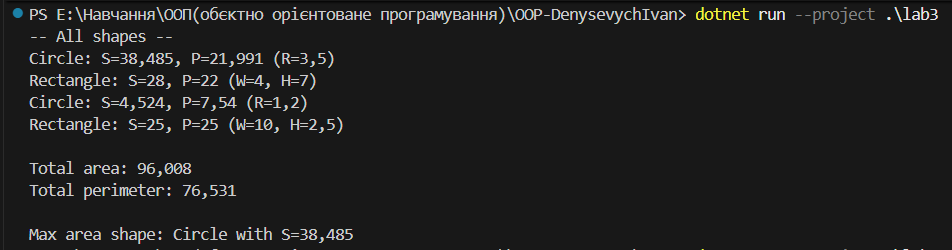

# Лабораторна робота 3  Наслідування

**Тема:** Наслідування: основи  
**Мета:** закріпити роботу з базовими/похідними класами, модифікаторами доступу, ase(...), irtual/override, поліморфізмом.

## Реалізація
- Базовий абстрактний клас Shape з методами Area() і Perimeter().
- Похідні: Circle, Rectangle, конструктори викликають ase(...).
- Поліморфізм  колекція List<Shape> з різними фігурами, сумування площ і периметрів, пошук фігури з максимальною площею.

## Приклад виводу

## Контрольні запитання

**1. Що таке наслідування та для чого воно використовується?**  
Наслідування — механізм ООП, що дозволяє створювати нові класи на основі існуючих. Похідний клас **отримує** публічні/захищені члени базового, може **розширювати** або **перевизначати** поведінку. Це зменшує дублювання коду і підвищує повторне використання.

**2. Чим відрізняється `virtual` від `abstract` методу?**  
- `abstract` — не має реалізації в базовому класі й **обов’язковий до перевизначення** в кожному непохідному від абстрактного класі.  
- `virtual` — **має** стандартну реалізацію в базовому класі, але **може** бути перевизначений в похідних (не обов’язково).

**3. Як працює ключове слово `base`?**  
`base` використовується в похідному класі для доступу до **членів базового класу**, зокрема для виклику **базового конструктора** (`: base(...)`) або звернення до перевизначених методів/властивостей базового класу.

**4. Що таке поліморфізм часу виконання?**  
Це здатність виклику методів через посилання на **базовий тип** викликати **перевизначені реалізації** похідних під час виконання (dynamic dispatch). У C# працює через `virtual`/`override`/`abstract`.

**5. У чому різниця між композицією та наслідуванням?**  
- **Наслідування** — зв’язок «**є**» (клас-нащадок **є** різновидом базового).  
- **Композиція/агрегація** — зв’язок «**має**» (клас **містить** інші об’єкти як частини).  
Композиція зазвичай гнучкіша (менше жорстких зв’язків), наслідування — зручне для спільної поведінки і поліморфізму.
