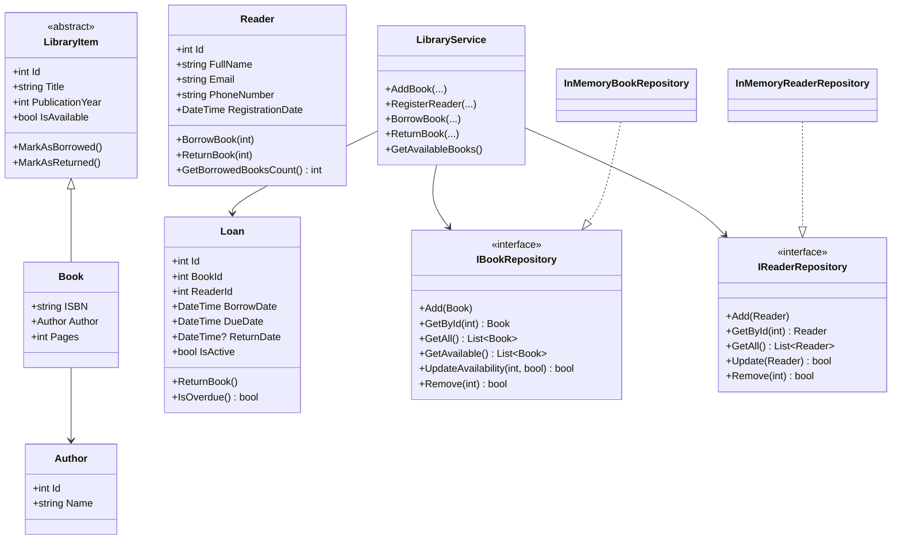

# Class Diagram

```mermaid
classDiagram
    class LibraryItem {
        <<abstract>>
        +int Id
        +string Title
        +int PublicationYear
        +bool IsAvailable
        +MarkAsBorrowed()
        +MarkAsReturned()
    }

    class Book {
        +string ISBN
        +Author Author
        +int Pages
    }

    class Author {
        +int Id
        +string Name
    }

    class Reader {
        +int Id
        +string FullName
        +string Email
        +string PhoneNumber
        +DateTime RegistrationDate
        +BorrowBook(int)
        +ReturnBook(int)
        +GetBorrowedBooksCount() int
    }

    class Loan {
        +int Id
        +int BookId
        +int ReaderId
        +DateTime BorrowDate
        +DateTime DueDate
        +DateTime? ReturnDate
        +bool IsActive
        +ReturnBook()
        +IsOverdue() bool
    }

    class IBookRepository {
        <<interface>>
        +Add(Book)
        +GetById(int) Book
        +GetAll() List~Book~
        +GetAvailable() List~Book~
        +UpdateAvailability(int, bool) bool
        +Remove(int) bool
    }

    class IReaderRepository {
        <<interface>>
        +Add(Reader)
        +GetById(int) Reader
        +GetAll() List~Reader~
        +Update(Reader) bool
        +Remove(int) bool
    }

    class LibraryService {
        +AddBook(...)
        +RegisterReader(...)
        +BorrowBook(...)
        +ReturnBook(...)
        +GetAvailableBooks()
    }

    class InMemoryBookRepository
    class InMemoryReaderRepository

    LibraryItem <|-- Book
    Book --> Author
    LibraryService --> IBookRepository
    LibraryService --> IReaderRepository
    InMemoryBookRepository ..|> IBookRepository
    InMemoryReaderRepository ..|> IReaderRepository
    LibraryService --> Loan
```
