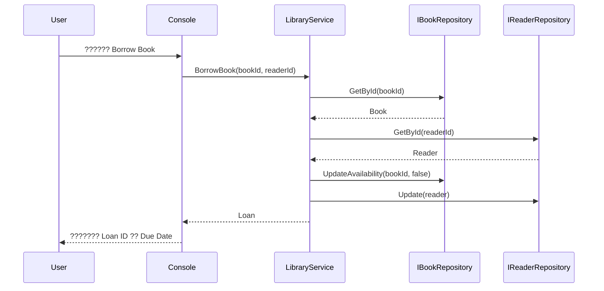
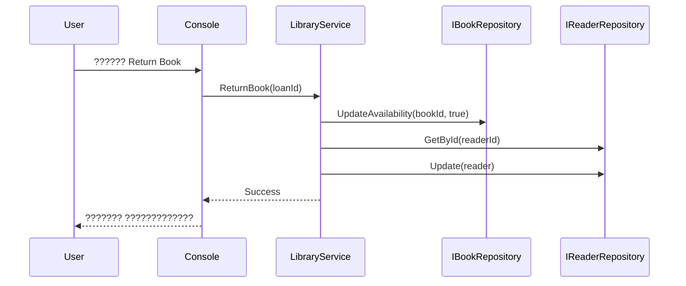

# Sequence Diagram

## Borrow Book

```mermaid
sequenceDiagram
    participant U as User
    participant C as Console
    participant S as LibraryService
    participant BR as IBookRepository
    participant RR as IReaderRepository

    U->>C: ?????? Borrow Book
    C->>S: BorrowBook(bookId, readerId)
    S->>BR: GetById(bookId)
    BR-->>S: Book
    S->>RR: GetById(readerId)
    RR-->>S: Reader
    S->>BR: UpdateAvailability(bookId, false)
    S->>RR: Update(reader)
    S-->>C: Loan
    C-->>U: ??????? Loan ID ?? Due Date
```

## Return Book

```mermaid
sequenceDiagram
    participant U as User
    participant C as Console
    participant S as LibraryService
    participant BR as IBookRepository
    participant RR as IReaderRepository

    U->>C: ?????? Return Book
    C->>S: ReturnBook(loanId)
    S->>BR: UpdateAvailability(bookId, true)
    S->>RR: GetById(readerId)
    S->>RR: Update(reader)
    S-->>C: Success
    C-->>U: ??????? ?????????????
```
