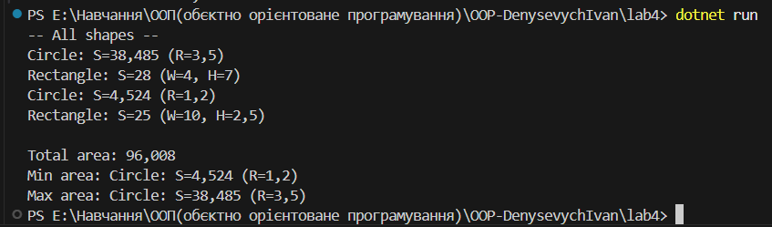

# Лабораторна робота 4 

**Тема:** Абстракції та інтерфейси. Композиція та агрегація.  
**Мета:**  навчитися створювати абстрактні класи та інтерфейси, будувати ієрархії класів із використанням композиції та агрегації, реалізовувати прості обчислення, демонструвати гнучкість і повторне використання коду.

## Реалізація
- Інтерфейс `IArea` з методами `GetArea()` і `Describe()`.
- Класи `Circle` і `Rectangle`, які реалізують інтерфейс.
- Допоміжний клас `AreaCalculator` для обчислення:
  - площ кожної фігури,
  - сумарної площі,
  - пошуку мінімальної та максимальної площі.
- Головна програма `Program.cs`, що створює список фігур, виконує обчислення та виводить результати в консоль.

## Приклад виводу

## Контрольні запитання

**1. У чому різниця між абстрактним класом і інтерфейсом?**  
Абстрактний клас може містити реалізацію, поля, конструктори. Інтерфейс визначає тільки контракт (сигнатури методів/властивостей).  
Клас може успадкувати один абстрактний клас, але реалізовувати кілька інтерфейсів.

**2. Коли краще використовувати композицію, а коли наслідування?**  
- Наслідування  коли є звязок є (Circle  це Shape).  
- Композиція  коли є звязок має (Car має Engine).  

**3. Як працює агрегація та чим вона відрізняється від композиції?**  
- Композиція  сильний звязок (компонент не існує без власника).  
- Агрегація  слабший звязок (обєкти можуть існувати окремо).  

**4. Чи може клас реалізовувати кілька інтерфейсів одночасно?**  
Так, у C# клас може реалізовувати необмежену кількість інтерфейсів.  

**5. Для чого в ООП використовують інтерфейси як контракти?**  
Інтерфейси задають контракт, який визначає обовязкові методи/властивості. Це дозволяє працювати з різними класами через спільний тип, спрощує розширюваність і підтримує поліморфізм.
