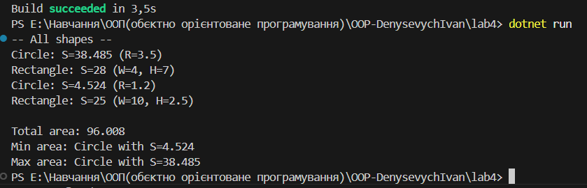

# Лабораторна робота 4  Калькулятор площ фігур

**Директорія:** `OOP-DenysevychIvan/lab4`  
**Тема:** Інтерфейси, абстрактні класи, композиція/агрегація  
**Мета:** Реалізувати інтерфейс `IArea` і абстрактний `Shape`, дві реалізації (`Circle`, `Rectangle`), використати композицію/агрегацію, додати коментарі та продемонструвати запуск.

## Виконання
- **Інтерфейс:** `IArea` (`Name`, `Area()`).
- **Абстрактний клас:** `Shape` (спільні риси; `DisplayInfo()`/`ToString()`).
- **Реалізації:** `Circle` (πr), `Rectangle` (wh).
- **Композиція/агрегація:** `AreaCalculator` агрегує `IList<IArea>`, рахує суму площ, мін/макс.
- **Коментарі:** звичайні `//` та `/* ... */` у ключових місцях.

## Запуск
```powershell
cd lab4
dotnet run
cd "E:\Навчання\ООП(обєктно орієнтоване програмування)\OOP-DenysevychIvan\lab4"

Set-Content -Encoding UTF8 .\README.md @'
# Лабораторна робота 4  Калькулятор площ фігур

**Директорія:** `OOP-DenysevychIvan/lab4`  
**Тема:** Інтерфейси, абстрактні класи, композиція/агрегація  
**Мета:** Реалізувати інтерфейс `IArea` і абстрактний `Shape`, дві реалізації (`Circle`, `Rectangle`), використати композицію/агрегацію, додати коментарі та продемонструвати запуск.

---

## Вимоги і виконання
- **Інтерфейс:** `IArea` (`Name`, `Area()`).
- **Абстрактний клас:** `Shape` (спільні риси; `DisplayInfo()`/`ToString()`).
- **Реалізації:** `Circle` (πr), `Rectangle` (wh).
- **Композиція/агрегація:** `AreaCalculator` агрегує `IList<IArea>`, рахує суму площ, знаходить мінімальну/максимальну.
- **Коментарі:** звичайні `//` та `/* ... */` у ключових місцях.

---

## Опис виконання
1. Створено інтерфейс `IArea` як **контракт** для фігур (імʼя + метод обчислення площі).
2. Побудовано абстрактний клас `Shape` зі спільною логікою (зберігає назву, надає форматований вивід).
3. Реалізовано дві фігури: `Circle`, `Rectangle`  **поліморфно** використовуються через `IArea`.
4. Додано `AreaCalculator`, що **агрегує** колекцію фігур і обчислює:
   - сумарну площу,
   - фігуру з мінімальною площею,
   - фігуру з максимальною площею.

---

## Запуск
```powershell
cd lab4
dotnet run
# 0) Перейти в корінь репозиторію
cd "E:\Навчання\ООП(обєктно орієнтоване програмування)\OOP-DenysevychIvan"

# 1) Повне очищення папки lab4 і створення проєкту заново
if (Test-Path .\lab4) { Remove-Item .\lab4 -Recurse -Force }
dotnet new console -n lab4
cd .\lab4

# 2) Структура як у ЛР3
mkdir -Force .\Models, .\screenshots | Out-Null

# 3) Код (звичайні коментарі, без XML)

# Models\IArea.cs
Set-Content -Encoding UTF8 .\Models\IArea.cs @'
namespace Lab4.Models
{
    // Контракт для фігур: мають імʼя і вміють обчислювати площу
    public interface IArea
    {
        string Name { get; }
        double Area();
    }
}

 
