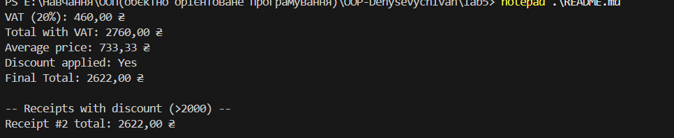

Лабораторна робота №5

Тема: Узагальнені типи (Generics), колекції і LINQ, обробка винятків  

\*\*Мета:\*\* Навчитися створювати узагальнені класи/методи, працювати з колекціями та LINQ, валідувати дані і створювати/обробляти винятки.

Структура програми

LineItem - описує товар (назва, кількість, ціна).  

Receipt - містить список товарів і методи для обчислень (сума, ПДВ, знижка).  

Repository<T> - узагальнений репозиторій для зберігання чеків.  

InvalidItemException - власний виняток при некоректних даних.  

Program.cs — демонстрація роботи та обробка винятків.

скриншоти виконання

     Контрольні запитання

1\. Що таке generics? Які їхні переваги?  
Generics — це узагальнені типи, які дозволяють створювати класи, методи або інтерфейси, що працюють з будь-яким типом даних без втрати типобезпеки.  
Переваги: повторне використання коду, відсутність приведення типів, більша швидкість і безпечність.

2\. Які основні відмінності між ArrayList і List<T>?  
ArrayList - зберігає дані типу `object`, тому потребує приведення типів.  
List<T> — строго типізована колекція, що перевіряється на етапі компіляції.

3\. Чим відрізняється Dictionary<TKey,TValue> від List<T>?  
`Dictionary` зберігає пари ключ-значення і дає швидкий доступ за ключем.  
`List` — просто послідовний список елементів без ключів.

4\. У чому перевага LINQ над класичними циклами?  
LINQ дозволяє описувати запити до колекцій у декларативній формі, роблячи код коротшим і зрозумілішим.
5\. Як працює ключове слово finally?  
Блок `finally` виконується завжди, незалежно від того, виник виняток чи ні.  
Використовується для звільнення ресурсів або фінальних дій.

6\. Коли доцільно створювати власні класи винятків?  
Коли потрібно обробити специфічну помилку (наприклад, неправильна ціна чи кількість), яку не покривають стандартні винятки .NET.

