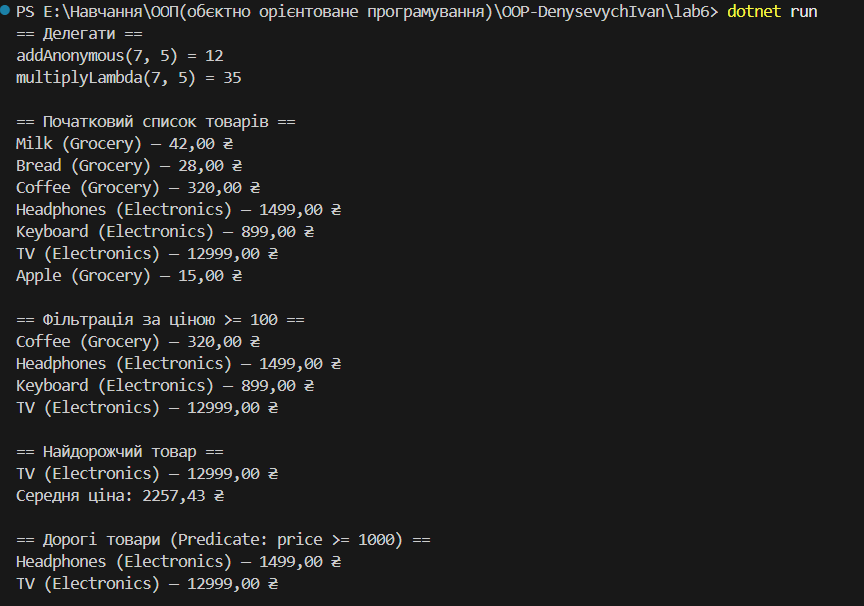
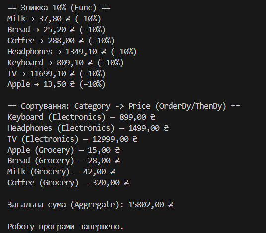

\# Лабораторна робота №6

Тема: Лямбда-вирази, анонімні функції та делегати у C#  

Мета: Закріпити знання про делегати та події.  

Навчитись використовувати анонімні методи, лямбда-вирази і вбудовані делегати (Func<>, Action<>, Predicate<>).  

Отримати практичний досвід застосування лямбда-виразів у колекціях і LINQ-операціях.

---

🧩 Структура програми

\- Product — клас товару (назва, ціна, категорія).  

\- Operation — власний делегат для арифметичних операцій.  

\- Func<> — обчислення знижки.  

\- Action<> — виведення інформації про товари.  

\- Predicate<> — перевірка, чи товар дорогий.  

\- LINQ — Where, Select, OrderBy, Aggregate, Average.

##📸 Результат виконання

