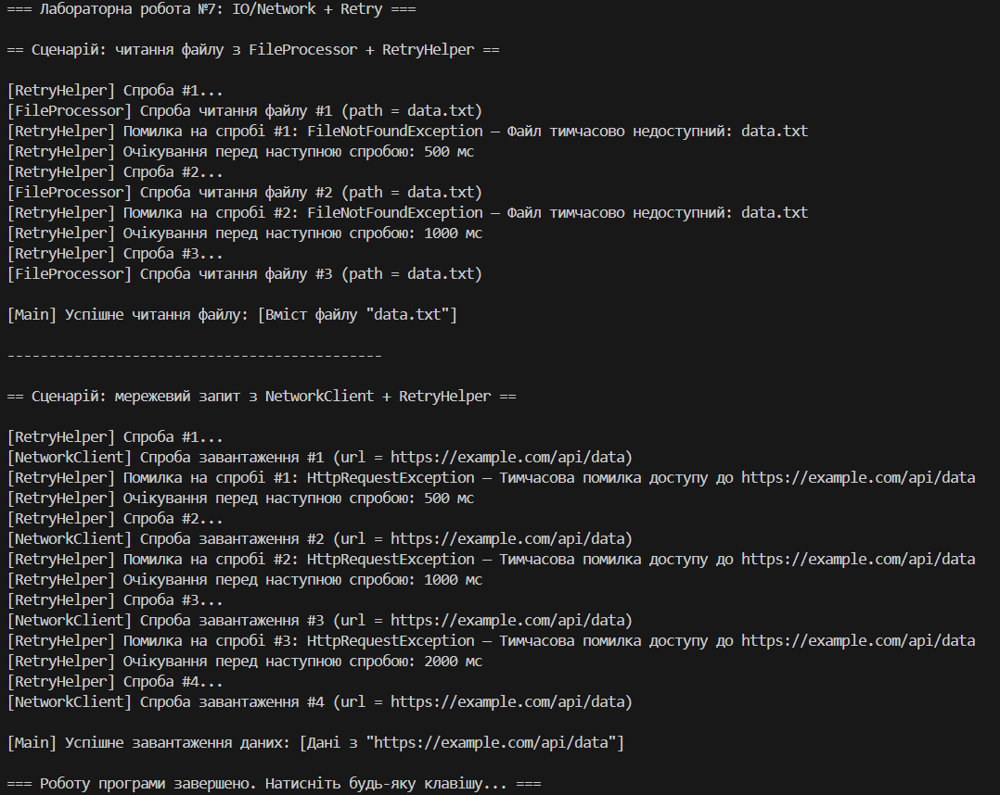

\# Лабораторна робота №7


\*\*Тема:\*\* Обробка IO/мережевих помилок та патерн Retry.  


\*\*Мета:\*\* Навчитися обробляти типові помилки вводу/виводу та мережеві помилки за допомогою блоків `try-catch-finally`, а також реалізувати патерн \*\*Retry\*\* з експоненційною затримкою.


---


\## 🧩 Структура програми


\- `Services/FileProcessor` — імітує читання файлу, перші 2 спроби кидає `FileNotFoundException`, потім повертає умовний вміст.

\- `Services/NetworkClient` — імітує мережевий запит, перші 3 спроби кидає `HttpRequestException`, потім повертає умовні дані.

\- `Services/RetryHelper` — статичний клас з методом  

&nbsp; `ExecuteWithRetry<T>(Func<T> operation, int retryCount, TimeSpan initialDelay, Func<Exception, bool> shouldRetry)`  

&nbsp; реалізує патерн Retry з експоненційною затримкою та логуванням спроб.

\- `Program.cs` — викликає `FileProcessor` і `NetworkClient` через `RetryHelper`, задає `shouldRetry` для `FileNotFoundException` та `HttpRequestException` і виводить результати в консоль.


---


\## Результат виконання



\*\*


```markdown

!\[File retry](screenshots/file\_retry.png)

!\[Network retry](screenshots/network\_retry.png)


